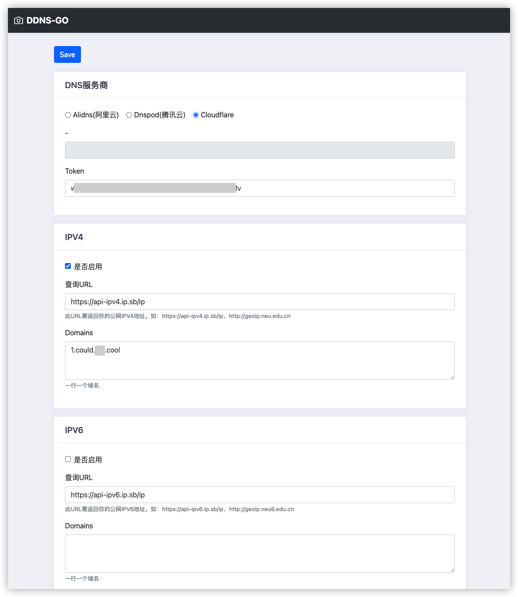

# ddns-go
- 自动获得你的IPV4或IPV6并解析到域名中
- Mac, Windows, Linux全支持，ARM，x86架构同时支持
- 间隔5分钟同步一次
- 支持的域名供应商 `alidns`

## 使用
- 下载[https://github.com/jeessy2/ddns-go/releases](https://github.com/jeessy2/ddns-go/releases)
- 双击运行，程序自动打开[http://127.0.0.1:9876](http://127.0.0.1:9876)，修改你的配置，成功



## Development
```
go get -u github.com/go-bindata/go-bindata/...
go-bindata -debug -pkg util -o util/staticPagesData.go static/pages/...
go-bindata -pkg static -o static/js_css_data.go -fs -prefix "static/" static/
```